  

   

  

   

  
  
  
  

---

---

---

<table>
  <tr>
    <td width="33%" align="center" valign="top">
      
      

        
        
      

    </td>
    <td width="33%" align="center" valign="top">
      
      

        
      

    </td>
    <td width="33%" align="center" valign="top">
      
      

        
        
      

    </td>
  </tr>
</table>

---

<table>
  <tr>
    <td width="50%" align="center" valign="top">
      
       
      
    </td>
    <td width="50%" align="center" valign="top">
      
       
      
    </td>
  </tr>
  <tr>
    <td width="50%" align="center" valign="top">
      
    </td>
    <td width="50%" align="center" valign="top">
      
    </td>
  </tr>
</table>

  
   
  

  

---

---

  <picture>
    <source media="(prefers-color-scheme: dark)" srcset="https://raw.githubusercontent.com/Eagl3Eyes/Eagl3Eyes/output/github-snake-dark.svg" />
    <source media="(prefers-color-scheme: light)" srcset="https://raw.githubusercontent.com/Eagl3Eyes/Eagl3Eyes/output/github-snake-light.svg" />
    
  </picture>

---

  
    
  <b>Thanks for stopping by ⭐</b> — if something here caught your eye, consider starring the repos you find useful.
    
  Designed &amp; built by Tuhin Al Jobayer · <a href="https://tuhinportfolio.netlify.app/">Portfolio</a> · <a href="mailto:tuhinjobayergolap007@gmail.com">Email</a>

